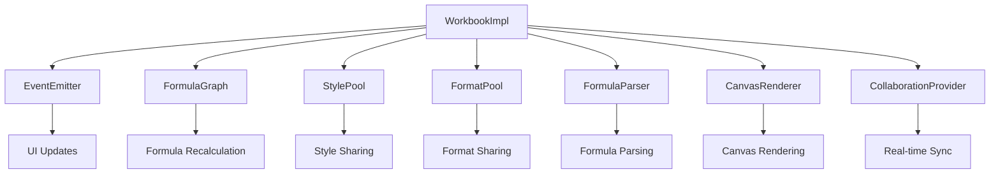

# Core Package Architecture

The core package implements the fundamental spreadsheet data model and business logic, designed to be framework-agnostic and optimized for performance.

## Workbook and Sheet Models

### Workbook Structure

The `WorkbookImpl` class in `packages/core/src/workbook.ts` is the central data model:

```typescript
export class WorkbookImpl implements Workbook {
  id: string;
  name: string;
  sheets: Map<string, Sheet> = new Map();
  activeSheetId: string;
  defaultRowHeight: number;
  defaultColWidth: number;

  // Core systems
  private events: EventEmitter;
  private formulaGraph: FormulaGraphImpl;
  private stylePool: StylePool;
  private formatPool: FormatPool;
  private formulaParser: FormulaParser;
  private selection: Selection;
}
```

Key responsibilities:

- **Sheet management**: Add, delete, and switch between sheets
- **Cell operations**: Set/get cell values, styles, and formulas
- **Selection management**: Track active cell and selection ranges
- **Undo/redo**: Maintain history stack for operations
- **Event coordination**: Emit events for UI updates
- **Data serialization**: Convert to/from JSON format

### Sheet Structure

Each sheet represents a single worksheet with sparse cell storage:

```typescript
interface Sheet {
  id: string;
  name: string;
  cells: Map<string, Cell>;  // Sparse storage: key format "row:col"
  config: SheetConfig;
  rowCount: number;
  colCount: number;
}
```

The sheet configuration includes:

- Default row/column dimensions
- Row heights and column widths (Map-based overrides)
- Hidden rows/columns
- Frozen panes settings
- Sort and filter configurations

## Sparse Cell Storage

### Cell Key Format

Cells are stored using a string key format `"row:col"` for efficient Map-based storage:

```typescript
// packages/core/src/utils/cell-key.ts
export function getCellKey(row: number, col: number): string {
  return `${row}:${col}`;
}

export function parseCellKey(key: string): { row: number; col: number } {
  const [row, col] = key.split(':').map(Number);
  return { row, col };
}
```

This approach provides:

- **Memory efficiency**: Only non-empty cells consume memory
- **Fast lookups**: O(1) access time
- **Serialization compatibility**: String keys work well with JSON
- **Range operations**: Easy iteration over cell ranges

### Cell Structure

Each cell contains the core data:

```typescript
interface Cell {
  value: CellValue;           // string | number | boolean | null
  formula?: string;           // Raw formula text (e.g., "=A1+B1")
  styleId?: string;           // Reference to shared style
  formatId?: string;          // Reference to shared format
  comment?: string;
  hyperlink?: string;
}
```

Cell values are stored as raw data, with formulas parsed separately.

## Style and Format Pooling

### Style Pool

Styles are pooled to reduce memory usage and enable efficient rendering:

```typescript
// packages/core/src/style-pool.ts
export class StylePool {
  private styles: Map<string, CellStyle> = new Map();
  private styleToId: Map<string, string> = new Map();

  getOrCreate(style: CellStyle): string {
    const styleKey = this.getStyleKey(style);
    const existingId = this.styleToId.get(styleKey);
    if (existingId) return existingId;

    const id = `style_${this.nextId++}`;
    this.styles.set(id, style);
    this.styleToId.set(styleKey, id);
    return id;
  }
}
```

Benefits:

- **Memory sharing**: Identical styles share the same object
- **Serialization efficiency**: Style objects are not duplicated
- **Fast comparison**: Style keys enable quick equality checks
- **Render optimization**: Style pooling reduces DOM/CSS operations

### Format Pool

Similar pooling system for number/text formats:

```typescript
export class FormatPool {
  // Similar implementation to StylePool
  getOrCreate(format: CellFormat): string {
    // Creates deterministic key from format properties
  }
}
```

Format objects include:

- Number formatting (decimal places, thousands separators)
- Currency formatting (symbol, position)
- Date/time formatting patterns
- Custom format patterns

## Event System

### Event Architecture

The event system enables loose coupling between the core and UI layers:

```typescript
// packages/core/src/event-emitter.ts
export class EventEmitter {
  private handlers: Map<EventType, Set<EventHandler>> = new Map();
  private batchQueue: EventData[] = [];
  private isBatching = false;

  emit(event: EventType, payload: unknown): void {
    if (this.isBatching) {
      this.batchQueue.push(data);
      return;
    }
    this.dispatch(data);
  }

  batch(operations: () => void): void {
    this.isBatching = true;
    this.batchQueue = [];
    try {
      operations();
    } finally {
      this.isBatching = false;
      // Dispatch all batched events
      for (const event of events) {
        this.dispatch(event);
      }
    }
  }
}
```

### Event Types

Core events include:

```typescript
type EventType =
  | 'cellChange'
  | 'cellSelection'
  | 'sheetChange'
  | 'sheetAdd'
  | 'sheetDelete'
  | 'sheetRename'
  | 'workbookChange';
```

### Event Batching

Operations that modify multiple cells batch events to prevent excessive re-renders:

```typescript
workbook.batch(() => {
  // Multiple cell updates batched into single event dispatch
  workbook.setCellValue(undefined, 0, 0, 'A');
  workbook.setCellValue(undefined, 0, 1, 'B');
  workbook.setCellValue(undefined, 0, 2, 'C');
});
// All changes dispatched as single batch
```

## Undo/Redo Mechanism

### History Management

The undo/redo system maintains snapshots of workbook state:

```typescript
// packages/core/src/workbook.ts
interface WorkbookSnapshot {
  sheets: Map<string, SheetSnapshot>;
  activeSheetId: string;
  selection: Selection;
}

private undoStack: WorkbookSnapshot[] = [];
private redoStack: WorkbookSnapshot[] = [];
private maxHistorySize = 50;
```

### Operation Recording

History is recorded automatically for destructive operations:

```typescript
private recordHistory(): void {
  if (this.isUndoing || this.isRedoing) return;

  const snapshot = this.createSnapshot();
  this.undoStack.push(snapshot);

  // Limit history size
  if (this.undoStack.length > this.maxHistorySize) {
    this.undoStack.shift();
  }

  // Clear redo stack on new operation
  this.redoStack = [];
}
```

### Undo/Redo Implementation

```typescript
undo(): boolean {
  if (this.undoStack.length === 0) return false;

  const currentSnapshot = this.createSnapshot();
  const previousSnapshot = this.undoStack.pop()!;

  this.redoStack.push(currentSnapshot);
  this.restoreSnapshot(previousSnapshot);

  return true;
}
```

## Data Serialization

### WorkbookData Format

The serialization format is optimized for size and compatibility:

```typescript
interface WorkbookData {
  id: string;
  name: string;
  activeSheetId: string;
  defaultRowHeight: number;
  defaultColWidth: number;
  stylePool: Record<string, CellStyle>;    // styleId -> style object
  formatPool?: Record<string, CellFormat>; // formatId -> format object
  sheets: SheetData[];
  selection?: Selection;
}
```

### SheetData Format

Sheet data includes sparse cell storage:

```typescript
interface SheetData {
  id: string;
  name: string;
  cells: Array<{ key: string; cell: Cell }>; // key format: "row:col"
  config: SheetConfig;
  rowCount: number;
  colCount: number;
}
```

### Serialization Benefits

- **Compact**: Only non-empty cells are stored
- **Efficient**: Style/format objects are deduplicated
- **Compatible**: Plain JSON format works across platforms
- **Version safe**: Optional fields allow backward compatibility

## Core Systems Integration

The workbook coordinates multiple specialized systems:



Each system is designed for specific responsibilities while maintaining clean interfaces for integration.
