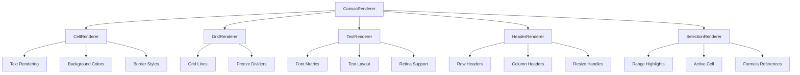

# Canvas Rendering System

The rendering system uses HTML5 Canvas for high-performance spreadsheet visualization, optimized for large datasets and smooth scrolling.

## Architecture Overview

The canvas rendering system is structured as a hierarchy of specialized renderers:



## Main Renderer (CanvasRenderer)

### Configuration and Initialization

The `CanvasRenderer` class coordinates all rendering operations:

```typescript
// packages/core/src/canvas/renderer.ts
export class CanvasRenderer {
  private canvas: HTMLCanvasElement;
  private ctx: CanvasRenderingContext2D;
  private devicePixelRatio: number;

  // Configuration
  private defaultRowHeight: number;
  private defaultColWidth: number;
  private headerHeight: number;
  private headerWidth: number;
  private theme: CanvasTheme;

  // Sub-renderers
  private textRenderer: TextRenderer;
  private gridRenderer: GridRenderer;
  private cellRenderer: CellRenderer;
  private headerRenderer: HeaderRenderer;
  private selectionRenderer: SelectionRenderer;
}
```

### Render State

Rendering requires comprehensive state information:

```typescript
// packages/core/src/canvas/types.ts
interface RenderState {
  cells: Map<string, Cell>;
  styles: Map<string, CellStyle>;
  formats: Map<string, CellFormat>;
  selection: Selection | null;
  activeCell: CellPosition | null;
  editingCell: CellPosition | null;
  rowHeights: Map<number, number>;
  colWidths: Map<number, number>;
  rowCount: number;
  colCount: number;
  formulaRanges?: FormulaRangeHighlight[];
  hiddenRows?: Set<number>;
  hiddenCols?: Set<number>;
  frozenRows?: number;
  frozenCols?: number;
  filters?: Map<number, ColumnFilter>;
  filteredRows?: Set<number>;
}
```

### Main Render Loop

The rendering process follows a specific order:

```typescript
private render(): void {
  // Calculate visible range
  this.calculateVisibleRange(state);

  // Clear canvas
  this.ctx.clearRect(0, 0, this.viewport.width, this.viewport.height);

  // Render in order (back to front):
  // 1. Main scrollable area
  this.renderRegion(state, 'main');

  // 2. Left frozen area
  if (hasFrozenCols) {
    this.renderRegion(state, 'left');
  }

  // 3. Top frozen area
  if (hasFrozenRows) {
    this.renderRegion(state, 'top');
  }

  // 4. Top-left frozen corner
  if (hasFrozenRows && hasFrozenCols) {
    this.renderRegion(state, 'top-left');
  }

  // 5. Freeze divider lines
  if (hasFrozenRows || hasFrozenCols) {
    this.renderFreezeDividers(frozenWidth, frozenHeight);
  }

  // 6. Headers
  this.renderHeaders(state);

  // 7. Corner cell
  this.renderCornerCell();
}
```

## Viewport Calculation and Optimization

### Visible Range Calculation

Only visible cells are rendered for performance:

```typescript
private calculateVisibleRange(state: RenderState): void {
  const { frozenWidth, frozenHeight } = this.freezeDimensions;
  const hasFrozenRows = this.frozenRows > 0;
  const hasFrozenCols = this.frozenCols > 0;

  // Calculate which rows/cols are visible in each region
  // Main region: accounts for scroll position
  // Frozen regions: always show first N rows/cols

  this.viewport.startRow = Math.max(0, Math.floor(scrollTop / defaultRowHeight) - 2);
  this.viewport.endRow = Math.min(
    rowCount - 1,
    Math.ceil((scrollTop + viewport.height) / defaultRowHeight) + 2
  );
}
```

### Dirty Region Tracking

Incremental updates reduce unnecessary re-rendering:

```typescript
private isDirty: boolean = true;
private dirtyRegions: DirtyRegion[] = [];

markDirty(region?: DirtyRegion): void {
  this.isDirty = true;
  if (region) {
    this.dirtyRegions.push(region);
  }
}

private render(): void {
  if (!this.renderState) return;

  // Skip rendering if not dirty
  if (!this.isDirty) return;

  // Render only dirty regions if specified
  if (this.dirtyRegions.length > 0) {
    this.renderDirtyRegions();
  } else {
    this.renderFull();
  }
}
```

## Freeze Panes Implementation

### Four-Region Architecture

Freeze panes divide the canvas into four regions:

```typescript
type FreezeRegion =
  | 'top-left'    // Frozen rows AND cols - never scrolls
  | 'top'         // Frozen rows only - scrolls horizontally
  | 'left'        // Frozen cols only - scrolls vertically
  | 'main';       // Regular scrollable area - scrolls both ways
```

### Freeze Dimensions Calculation

```typescript
// packages/core/src/features/freeze.ts
export function calculateFreezeDimensions(
  frozenRows: number,
  frozenCols: number,
  rowHeights: Map<number, number>,
  colWidths: Map<number, number>,
  defaultRowHeight: number,
  defaultColWidth: number
): FreezeDimensions {
  let frozenWidth = 0;
  for (let c = 0; c < frozenCols; c++) {
    frozenWidth += colWidths.get(c) ?? defaultColWidth;
  }

  let frozenHeight = 0;
  for (let r = 0; r < frozenRows; r++) {
    frozenHeight += rowHeights.get(r) ?? defaultRowHeight;
  }

  return { frozenWidth, frozenHeight };
}
```

### Region-Specific Rendering

Each region renders with appropriate scroll offsets:

```typescript
private renderRegion(state: RenderState, region: FreezeRegion): void {
  const clipRect = getClipRectForRegion(region, ...);
  const { effectiveScrollTop, effectiveScrollLeft } = getScrollForRegion(region, scrollTop, scrollLeft);

  // Set clipping
  this.ctx.save();
  this.ctx.beginPath();
  this.ctx.rect(clipRect.x, clipRect.y, clipRect.width, clipRect.height);
  this.ctx.clip();

  // Render cells, grid, selection for this region
  this.renderCellsInRegion(state, region, effectiveScrollTop, effectiveScrollLeft);
  this.renderGridInRegion(state, region);
  this.renderSelectionInRegion(state, region);

  this.ctx.restore();
}
```

## Hit Testing System

### Coordinate Mapping

The `HitTester` class maps mouse coordinates to grid positions:

```typescript
// packages/core/src/canvas/hit-testing.ts
export class HitTester {
  private headerWidth: number;
  private headerHeight: number;
  private defaultRowHeight: number;
  private defaultColWidth: number;

  // Dimension maps updated from render state
  private rowHeights: Map<number, number> = new Map();
  private colWidths: Map<number, number> = new Map();
}
```

### Hit Test Methods

```typescript
hitTest(x: number, y: number): HitTestResult {
  // Check if in headers
  if (x <= this.headerWidth && y <= this.headerHeight) {
    return { type: 'corner' };
  }

  if (x <= this.headerWidth) {
    return this.hitTestRowHeader(y);
  }

  if (y <= this.headerHeight) {
    return this.hitTestColHeader(x);
  }

  // In grid area
  return this.hitTestGrid(x, y);
}

private hitTestGrid(x: number, y: number): CellPosition {
  const region = getRegionAtPoint(x, y, this.frozenWidth, this.frozenHeight, this.headerWidth, this.headerHeight);
  const { effectiveScrollTop, effectiveScrollLeft } = getScrollForRegion(region, this.scrollTop, this.scrollLeft);

  // Convert canvas coordinates to grid coordinates
  const gridX = x - this.headerWidth + effectiveScrollLeft;
  const gridY = y - this.headerHeight + effectiveScrollTop;

  // Find row and column indices
  let row = this.findRowAtY(gridY);
  let col = this.findColAtX(gridX);

  return { row, col };
}
```

## Retina Display Support

### High-DPI Rendering

Canvas automatically scales for retina displays:

```typescript
constructor(config: CanvasRendererConfig) {
  this.devicePixelRatio = window.devicePixelRatio || 1;

  // Set actual canvas size (physical pixels)
  this.canvas.width = config.width * this.devicePixelRatio;
  this.canvas.height = config.height * this.devicePixelRatio;

  // Set display size (CSS pixels)
  this.canvas.style.width = config.width + 'px';
  this.canvas.style.height = config.height + 'px';

  // Scale context to match device pixel ratio
  this.ctx.scale(this.devicePixelRatio, this.devicePixelRatio);
}
```

### Font and Line Scaling

All measurements are automatically scaled:

```typescript
private getScaledFontSize(baseSize: number): number {
  return baseSize * this.devicePixelRatio;
}

private getScaledLineWidth(baseWidth: number): number {
  return Math.max(1, baseWidth * this.devicePixelRatio);
}
```

## Sub-Renderer Details

### CellRenderer

Handles individual cell rendering including text, backgrounds, and borders:

```typescript
renderCell(
  ctx: CanvasRenderingContext2D,
  cell: Cell | undefined,
  bounds: Rect,
  style: CellStyle | undefined,
  format: CellFormat | undefined
): void {
  // Render background
  this.renderBackground(ctx, bounds, style);

  // Render borders
  this.renderBorders(ctx, bounds, style);

  // Render text content
  if (cell?.value !== null && cell?.value !== undefined) {
    this.renderText(ctx, cell, bounds, style, format);
  }
}
```

### TextRenderer

Handles font loading, metrics calculation, and text layout:

```typescript
measureText(text: string, style: TextStyle): TextMetrics {
  const fontKey = this.getFontKey(style);
  const metrics = this.fontMetricsCache.get(fontKey);

  if (!metrics) {
    // Calculate and cache font metrics
    const calculated = this.calculateFontMetrics(style);
    this.fontMetricsCache.set(fontKey, calculated);
    return calculated;
  }

  return metrics;
}
```

### GridRenderer

Renders grid lines and freeze pane dividers:

```typescript
renderGrid(
  ctx: CanvasRenderingContext2D,
  viewport: Viewport,
  rowHeights: Map<number, number>,
  colWidths: Map<number, number>
): void {
  ctx.strokeStyle = this.theme.gridLineColor;
  ctx.lineWidth = this.theme.gridLineWidth;

  // Render vertical grid lines
  this.renderVerticalGridLines(ctx, viewport);

  // Render horizontal grid lines
  this.renderHorizontalGridLines(ctx, viewport);
}
```

### SelectionRenderer

Handles selection highlighting, active cell indication, and formula range previews:

```typescript
render(
  ctx: CanvasRenderingContext2D,
  selection: Selection | null,
  activeCell: CellPosition | null,
  viewport: Viewport,
  // ... additional parameters
): void {
  // Render formula reference highlights (behind selection)
  if (formulaRanges) {
    this.renderFormulaRanges(ctx, formulaRanges, ...);
  }

  // Render selection ranges
  if (selection) {
    this.renderSelectionRanges(ctx, selection.ranges, ...);
  }

  // Render active cell highlight
  if (activeCell) {
    this.renderActiveCell(ctx, activeCell, ...);
  }
}
```

## Performance Optimizations

### 1. Visible Range Only

Only cells within the viewport are rendered:

```typescript
// Calculate visible bounds with buffer
const buffer = 2; // Render extra cells outside viewport
startRow = Math.max(0, firstVisibleRow - buffer);
endRow = Math.min(rowCount - 1, lastVisibleRow + buffer);
startCol = Math.max(0, firstVisibleCol - buffer);
endCol = Math.min(colCount - 1, lastVisibleCol + buffer);
```

### 2. Dirty Region Updates

Only changed areas are re-rendered:

```typescript
// Mark specific regions as dirty
markCellsDirty(row: number, col: number): void {
  this.dirtyRegions.push({ type: 'cells', row, col });
}

markSelectionDirty(): void {
  this.dirtyRegions.push({ type: 'selection' });
}
```

### 3. Object Reuse

Renderers reuse objects to avoid garbage collection:

```typescript
private tempRect: Rect = { x: 0, y: 0, width: 0, height: 0 };
private tempPoint: Point = { x: 0, y: 0 };

calculateCellBounds(row: number, col: number): Rect {
  // Reuse tempRect object
  this.tempRect.x = this.getColLeft(col);
  this.tempRect.y = this.getRowTop(row);
  this.tempRect.width = this.getColWidth(col);
  this.tempRect.height = this.getRowHeight(row);
  return this.tempRect;
}
```

### 4. Font Metrics Caching

Font measurements are cached to avoid repeated calculations:

```typescript
private fontMetricsCache: Map<string, FontMetricsCache> = new Map();

getFontKey(style: TextStyle): string {
  return `${style.fontFamily}-${style.fontSize}-${style.fontWeight}-${style.fontStyle}`;
}
```

The canvas rendering system provides the foundation for smooth, scalable spreadsheet rendering with support for advanced features like freeze panes, filtering, and high-DPI displays.
