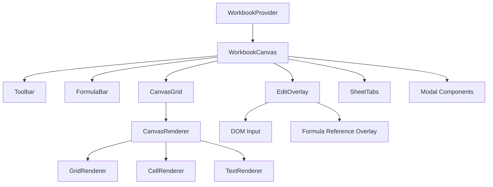

# Sheets Package Architecture

The sheets package provides React components that create the spreadsheet UI, bridging the framework-agnostic core with React's component model.

At its core, the sheets implementation combines the efficiency of HTML5 canvas rendering with the flexibility of DOM-based editing. The canvas element handles the heavy lifting of drawing the spreadsheet grid, cell borders, text content, and visual formatting for thousands of cells simultaneously, providing smooth scrolling and high performance even with large datasets. When a user double-clicks a cell or starts typing, a DOM-based edit overlay appears positioned exactly over that cell, providing the familiar text input experience that browsers excel at.

All spreadsheet state is managed through a central workbook object that acts as the single source of truth, containing sheets, cells, formulas, and metadata. This workbook uses an event-driven approach, emitting notifications whenever data changes, which triggers React components to update their displays and keeps the entire UI synchronized. The workbook also manages complex features like multi-sheet navigation, cell references, and calculation dependencies.

Visual styling and data formatting are handled through dedicated style and format pools that store reusable definitions separately from cell data. This approach minimizes memory usage by avoiding duplication - a style definition is stored once and referenced by multiple cells. During rendering, these pools are consulted to apply the correct visual appearance, from number formatting (currency, percentages) to cell styling (colors, borders, fonts), ensuring consistent presentation across the spreadsheet.

Keyboard interactions are seamlessly coordinated between the canvas and edit overlay components. When not editing, the canvas handles navigation keys (arrow keys, Tab, Enter) to move between cells and selection keys (Shift+arrows) to extend selections. Once editing begins, keyboard focus shifts to the edit overlay, which handles text input, formula editing features like reference insertion, and commit/cancel actions (Enter to save, Escape to cancel). This division of responsibility creates a smooth, intuitive editing experience that feels natural to spreadsheet users.

## Architecture Overview

### Component Hierarchy

The sheets package follows a layered architecture:



### WorkbookContext Pattern

State management uses React Context with event-driven updates:

```typescript
// packages/sheets/src/context/WorkbookContext.tsx
interface WorkbookContextValue {
  workbook: WorkbookImpl;
  updateWorkbook: (updater: (wb: WorkbookImpl) => void) => void;
}

export function WorkbookProvider({ workbook: initialWorkbook, children }) {
  const [workbook] = useState<WorkbookImpl>(initialWorkbook);
  const [updateTrigger, setUpdateTrigger] = useState(0);

  // Subscribe to workbook events
  useEffect(() => {
    const handleCellChange = () => setUpdateTrigger(prev => prev + 1);
    const handleSheetChange = () => setUpdateTrigger(prev => prev + 1);

    workbook.on('cellChange', handleCellChange);
    workbook.on('sheetChange', handleSheetChange);
    // ... other event handlers

    return () => {
      workbook.off('cellChange', handleCellChange);
      workbook.off('sheetChange', handleSheetChange);
      // ... cleanup
    };
  }, [workbook]);

  const updateWorkbook = useCallback((updater: (wb: WorkbookImpl) => void) => {
    updater(workbook);
    setUpdateTrigger(prev => prev + 1);
  }, [workbook]);

  return (
    <WorkbookContext.Provider value={{ workbook, updateWorkbook }}>
      {children}
    </WorkbookContext.Provider>
  );
}
```

## WorkbookCanvas Component

### Main Component Structure

WorkbookCanvas is the root component that orchestrates all UI elements:

```typescript
// packages/sheets/src/components/WorkbookCanvas.tsx
export const WorkbookCanvas = memo(function WorkbookCanvas({
  className,
  style,
  width = 800,
  height = 600,
  rowHeight = 20,
  colWidth = 100,
}: WorkbookCanvasProps) {
  const { workbook } = useWorkbook();

  // State management
  const [activeCell, setActiveCell] = useState<CellPosition | null>(null);
  const [editingCell, setEditingCell] = useState<CellPosition | null>(null);
  const [editValue, setEditValue] = useState('');

  // Layout calculations
  const toolbarHeight = 44;
  const formulaBarHeight = 32;
  const sheetTabsHeight = 36;
  const canvasAreaHeight = height - toolbarHeight - formulaBarHeight - sheetTabsHeight;

  return (
    <div className={className} style={{ ...style, width, height }}>
      <Toolbar
        onFormatCells={() => setFormatModal({ isOpen: true })}
        onFilter={() => setFilterModal({ isOpen: true, column: activeCell?.col })}
      />

      <FormulaBar
        activeCell={activeCell}
        value={editingCell ? editValue : workbook.getCellValue()?.toString() || ''}
        onChange={setEditValue}
        onCommit={handleFormulaBarCommit}
      />

      <div style={{ height: canvasAreaHeight, position: 'relative' }}>
        <CanvasGrid
          width={width}
          height={canvasAreaHeight}
          activeCell={activeCell}
          onActiveCellChange={setActiveCell}
          onCellEdit={handleCellEdit}
          // ... other props
        />

        {editingCell && (
          <EditOverlay
            cell={editingCell}
            value={editValue}
            onChange={setEditValue}
            onCommit={handleCellCommit}
            onCancel={handleCellCancel}
            // ... positioning props
          />
        )}
      </div>

      <SheetTabs
        sheets={workbook.sheets}
        activeSheetId={workbook.activeSheetId}
        onSheetSelect={handleSheetSelect}
        onSheetAdd={handleSheetAdd}
        onSheetDelete={handleSheetDelete}
      />

      {/* Modal dialogs */}
      {filterModal?.isOpen && (
        <FilterModal
          column={filterModal.column}
          existingFilter={filterModal.existingFilter}
          onApply={handleFilterApply}
          onClose={() => setFilterModal(null)}
        />
      )}
    </div>
  );
});
```

### Layout Management

The component manages complex layout calculations:

```typescript
// Calculate available space for canvas
const toolbarHeight = 44;
const formulaBarHeight = 32;
const sheetTabsHeight = 36;
const canvasAreaHeight = height - toolbarHeight - formulaBarHeight - sheetTabsHeight;
const canvasAreaWidth = width;

// Position edit overlay relative to cell
const cellBounds = calculateCellBounds(editingCell.row, editingCell.col);
const overlayX = cellBounds.x;
const overlayY = cellBounds.y;
const overlayWidth = Math.max(cellBounds.width, 100); // Minimum width
```

### Event Coordination

WorkbookCanvas coordinates between multiple event sources:

```typescript
// Handle cell editing workflow
const handleCellEdit = useCallback((cell: CellPosition, initialValue: string) => {
  setEditingCell(cell);
  setEditValue(initialValue);
  setOriginalEditingSheetId(workbook.activeSheetId);
}, [workbook.activeSheetId]);

const handleCellCommit = useCallback((value: string) => {
  if (editingCell) {
    workbook.setCellValue(undefined, editingCell.row, editingCell.col, value);
  }
  setEditingCell(null);
  setEditValue('');
  setOriginalEditingSheetId(null);
}, [editingCell, workbook]);

const handleCellCancel = useCallback(() => {
  setEditingCell(null);
  setEditValue('');
  setOriginalEditingSheetId(null);
}, [editingCell]);
```

## CanvasGrid Component

### Canvas Integration

CanvasGrid bridges React with the canvas rendering system:

```typescript
// packages/sheets/src/components/CanvasGrid.tsx
export const CanvasGrid = memo(function CanvasGrid({
  width,
  height,
  rowHeight = 20,
  colWidth = 100,
  activeCell,
  onActiveCellChange,
  onCellEdit,
  onSelectionChange,
  onScroll,
  // ... other props
}: CanvasGridProps) {
  const { workbook } = useWorkbook();
  const canvasRef = useRef<HTMLCanvasElement>(null);
  const rendererRef = useRef<CanvasRenderer | null>(null);

  // Initialize renderer
  useEffect(() => {
    if (canvasRef.current && !rendererRef.current) {
      rendererRef.current = new CanvasRenderer({
        canvas: canvasRef.current,
        defaultRowHeight: rowHeight,
        defaultColWidth: colWidth,
        // ... config
      });
    }
  }, [rowHeight, colWidth]);

  // Update render state when workbook changes
  useEffect(() => {
    if (!rendererRef.current) return;

    const sheet = workbook.getSheet();
    const renderState: RenderState = {
      cells: sheet.cells,
      styles: workbook.stylePool.getAllStyles(),
      formats: workbook.formatPool.getAllFormats(),
      selection: workbook.selection,
      activeCell,
      editingCell,
      // ... other state
    };

    rendererRef.current.updateRenderState(renderState);
    rendererRef.current.render();
  }, [workbook, activeCell, editingCell, dimensionVersion]);
});
```

### Mouse Event Handling

CanvasGrid translates canvas events to React callbacks:

```typescript
const handleCanvasClick = useCallback((event: React.MouseEvent) => {
  if (!canvasRef.current || !rendererRef.current) return;

  const rect = canvasRef.current.getBoundingClientRect();
  const x = event.clientX - rect.left;
  const y = event.clientY - rect.top;

  const hitResult = rendererRef.current.hitTest(x, y);

  if (hitResult.type === 'cell') {
    onActiveCellChange(hitResult.cell);
  } else if (hitResult.type === 'header') {
    handleHeaderClick(hitResult);
  }
}, [onActiveCellChange]);

const handleCanvasDoubleClick = useCallback((event: React.MouseEvent) => {
  const hitResult = getHitResult(event);

  if (hitResult.type === 'cell') {
    const cell = workbook.getCell(hitResult.cell.row, hitResult.cell.col);
    const initialValue = cell?.value?.toString() || '';
    onCellEdit(hitResult.cell, initialValue);
  }
}, [workbook, onCellEdit]);
```

### Scroll Synchronization

CanvasGrid manages scroll state and synchronization:

```typescript
const [scrollTop, setScrollTop] = useState(0);
const [scrollLeft, setScrollLeft] = useState(0);

const handleScroll = useCallback((newScrollTop: number, newScrollLeft: number) => {
  setScrollTop(newScrollTop);
  setScrollLeft(newScrollLeft);

  // Update renderer viewport
  rendererRef.current?.setViewport({
    scrollTop: newScrollTop,
    scrollLeft: newScrollLeft,
    width,
    height,
  });

  // Notify parent
  onScroll?.(newScrollTop, newScrollLeft);
}, [width, height, onScroll]);
```

## EditOverlay Component

### DOM Overlay Architecture

EditOverlay provides DOM-based text input over the canvas:

```typescript
// packages/sheets/src/components/EditOverlay.tsx
export const EditOverlay = memo(forwardRef<EditOverlayRef, EditOverlayProps>(
  function EditOverlay({
    cell,
    value,
    onChange,
    onCommit,
    onCancel,
    x,
    y,
    width,
    height,
    minWidth = 100,
    fontSize = 11,
    fontFamily = 'Arial',
    isEditingFormula = false,
    cellFormat,
  }, ref) {
    const inputRef = useRef<HTMLInputElement>(null);

    // Position overlay to match cell bounds
    const overlayStyle: React.CSSProperties = {
      position: 'absolute',
      left: x,
      top: y,
      width: Math.max(width, minWidth),
      height: height,
      fontSize,
      fontFamily,
      // Match canvas cell styling
      border: '2px solid #0078d4',
      backgroundColor: 'white',
      padding: '0 2px',
      outline: 'none',
      zIndex: 1000,
    };

    const handleKeyDown = (event: React.KeyboardEvent) => {
      if (event.key === 'Enter') {
        onCommit(value);
      } else if (event.key === 'Escape') {
        onCancel();
      } else if (event.key === 'Tab') {
        // Handle tab navigation
        event.preventDefault();
        handleTabNavigation(event.shiftKey);
      }
    };

    useImperativeHandle(ref, () => ({
      insertAtCursor: (text: string, replaceExisting = false) => {
        // Insert text at cursor position
      },
      getCursorPosition: () => {
        return inputRef.current?.selectionStart || 0;
      },
      focus: () => {
        inputRef.current?.focus();
      },
    }), []);

    return (
      <input
        ref={inputRef}
        type="text"
        value={value}
        onChange={(e) => onChange(e.target.value)}
        onKeyDown={handleKeyDown}
        onBlur={handleBlur}
        style={overlayStyle}
        autoFocus
      />
    );
  }
));
```

### Formula Editing Features

EditOverlay supports advanced formula editing:

```typescript
// Handle formula reference insertion
const handleReferenceInsert = useCallback((reference: string) => {
  if (!inputRef.current) return;

  const start = inputRef.current.selectionStart || 0;
  const end = inputRef.current.selectionEnd || 0;
  const newValue = value.substring(0, start) + reference + value.substring(end);

  onChange(newValue);

  // Restore cursor position after reference
  setTimeout(() => {
    inputRef.current?.setSelectionRange(start + reference.length, start + reference.length);
  }, 0);
}, [value, onChange]);
```

## Context Menu System

### Dynamic Context Menus

Context menus adapt based on selection type:

```typescript
type ContextMenuType =
  | { type: 'cell'; cell: CellPosition; x: number; y: number }
  | { type: 'row'; index: number; x: number; y: number }
  | { type: 'column'; index: number; x: number; y: number };

const handleContextMenu = useCallback((menuType: ContextMenuType) => {
  setContextMenu(menuType);
}, []);

const renderContextMenu = () => {
  if (!contextMenu) return null;

  switch (contextMenu.type) {
    case 'cell':
      return (
        <ContextMenu
          x={contextMenu.x}
          y={contextMenu.y}
          onCut={handleCut}
          onCopy={handleCopy}
          onPaste={handlePaste}
          onDelete={handleDelete}
          onInsertRow={handleInsertRow}
          onInsertColumn={handleInsertColumn}
        />
      );
    case 'row':
      return (
        <HeaderContextMenu
          type="row"
          index={contextMenu.index}
          x={contextMenu.x}
          y={contextMenu.y}
          onDelete={handleDeleteRow}
          onInsert={handleInsertRow}
        />
      );
  }
};
```

## Modal Dialog Management

### State-Based Modals

Modals are managed through component state:

```typescript
const [filterModal, setFilterModal] = useState<{
  isOpen: boolean;
  column: number;
  existingFilter?: ColumnFilter;
} | null>(null);

const [formatModal, setFormatModal] = useState<{
  isOpen: boolean;
  currentFormat?: CellFormat;
  sampleValue?: number;
} | null>(null);

// Open filter modal
const handleFilterClick = useCallback(() => {
  if (!activeCell) return;

  const sheet = workbook.getSheet();
  const existingFilter = sheet.config.filters?.get(activeCell.col);

  setFilterModal({
    isOpen: true,
    column: activeCell.col,
    existingFilter,
  });
}, [activeCell, workbook]);

// Handle filter application
const handleFilterApply = useCallback((filter: ColumnFilter) => {
  workbook.setFilter(activeCell!.col, filter);
  setFilterModal(null);
}, [activeCell, workbook]);
```

## Performance Optimizations

### Memoization

Components use React.memo to prevent unnecessary re-renders:

```typescript
export const WorkbookCanvas = memo(function WorkbookCanvas(props) {
  // Component logic
});

export const CanvasGrid = memo(function CanvasGrid(props) {
  // Component logic
});
```

### Ref-Based Communication

Direct refs avoid prop drilling for performance-critical operations:

```typescript
const editOverlayRef = useRef<EditOverlayRef>(null);

// Direct communication with edit overlay
const insertCellReference = useCallback((reference: string) => {
  editOverlayRef.current?.insertAtCursor(reference, false);
}, []);
```

### Event Debouncing

Rapid events are debounced to improve performance:

```typescript
const debouncedScroll = useMemo(
  () => debounce((scrollTop: number, scrollLeft: number) => {
    handleScroll(scrollTop, scrollLeft);
  }, 16), // ~60fps
  [handleScroll]
);
```

## State Synchronization

### Workbook to React State

Workbook changes trigger React re-renders through context:

```typescript
// In WorkbookProvider
useEffect(() => {
  const handleCellChange = () => {
    setUpdateTrigger(prev => prev + 1);
  };

  workbook.on('cellChange', handleCellChange);

  return () => {
    workbook.off('cellChange', handleCellChange);
  };
}, [workbook]);
```

### React to Workbook Updates

UI actions update the workbook directly:

```typescript
const updateWorkbook = useCallback((updater: (wb: WorkbookImpl) => void) => {
  updater(workbook);
  setUpdateTrigger(prev => prev + 1); // Trigger re-render
}, [workbook]);
```

The sheets package provides a clean React interface to the core spreadsheet engine, with optimized rendering and comprehensive user interactions.
