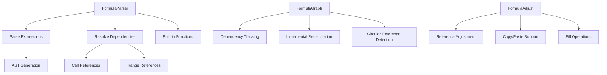

# Formula System

The formula system provides spreadsheet calculation capabilities with dependency tracking, incremental recalculation, and support for Excel-compatible functions.

## Architecture Overview

The formula system consists of three main components:



## Formula Parser

### Core Parser Class

The `FormulaParser` handles expression parsing and evaluation:

```typescript
// packages/core/src/formula-parser/parser.ts
export class FormulaParser {
  private functions: Map<string, (args: unknown[], ctx: EvaluationContext) => unknown> = new Map();

  constructor() {
    this.registerBuiltInFunctions();
  }

  parse(formula: string, currentRow: number = 0, currentCol: number = 0): ParseResult {
    // Remove leading = if present
    const expression = formula.startsWith('=') ? formula.slice(1) : formula;

    // Parse expression and collect dependencies
    const ast = this.parseExpression(expression, currentRow, currentCol, dependencies);

    return { ast, dependencies, error };
  }
}
```

### Built-in Functions

The parser includes common spreadsheet functions:

```typescript
private registerBuiltInFunctions(): void {
  // Mathematical functions
  this.functions.set('SUM', (args, ctx) => {
    const values = this.flattenArgs(args, ctx);
    return values.reduce((sum, val) => sum + Number(val) || 0, 0);
  });

  this.functions.set('AVERAGE', (args, ctx) => {
    const values = this.flattenArgs(args, ctx);
    const numbers = values.map(Number).filter(n => !isNaN(n));
    return numbers.length > 0 ? numbers.reduce((a, b) => a + b, 0) / numbers.length : 0;
  });

  // Logical functions
  this.functions.set('IF', (args, ctx) => {
    if (args.length < 2) return null;
    const condition = Boolean(args[0]);
    return condition ? args[1] : (args.length > 2 ? args[2] : null);
  });

  // Statistical functions
  this.functions.set('COUNT', (args, ctx) => {
    const values = this.flattenArgs(args, ctx);
    return values.filter(v => v != null && v !== '').length;
  });

  this.functions.set('MAX', (args, ctx) => {
    const values = this.flattenArgs(args, ctx);
    const numbers = values.map(Number).filter(n => !isNaN(n));
    return numbers.length > 0 ? Math.max(...numbers) : 0;
  });

  this.functions.set('MIN', (args, ctx) => {
    const values = this.flattenArgs(args, ctx);
    const numbers = values.map(Number).filter(n => !isNaN(n));
    return numbers.length > 0 ? Math.min(...numbers) : 0;
  });
}
```

### Expression Parsing

The parser builds an Abstract Syntax Tree (AST) from formula expressions:

```typescript
private parseExpression(
  expr: string,
  currentRow: number,
  currentCol: number,
  dependencies: Set<string>
): FormulaNode {
  expr = expr.trim();

  // Handle function calls
  if (this.isFunctionCall(expr)) {
    return this.parseFunctionCall(expr, currentRow, currentCol, dependencies);
  }

  // Handle cell references
  const cellRef = parseCellReference(expr);
  if (cellRef) {
    const key = cellReferenceToKey(cellRef, currentRow, currentCol);
    dependencies.add(key);
    return { type: 'cellReference', key };
  }

  // Handle literals
  if (this.isNumber(expr)) {
    return { type: 'number', value: parseFloat(expr) };
  }
  if (this.isString(expr)) {
    return { type: 'string', value: expr.slice(1, -1) }; // Remove quotes
  }

  // Handle operators
  const operatorMatch = this.findLowestPrecedenceOperator(expr);
  if (operatorMatch) {
    const { operator, index } = operatorMatch;
    const leftExpr = expr.substring(0, index).trim();
    const rightExpr = expr.substring(index + operator.length).trim();

    return {
      type: 'operator',
      operator,
      left: this.parseExpression(leftExpr, currentRow, currentCol, dependencies),
      right: this.parseExpression(rightExpr, currentRow, currentCol, dependencies),
    };
  }

  throw new Error(`Unable to parse expression: ${expr}`);
}
```

## Dependency Graph

### FormulaGraph Implementation

The `FormulaGraphImpl` manages formula dependencies for efficient recalculation:

```typescript
// packages/core/src/formula-graph.ts
export class FormulaGraphImpl implements FormulaGraph {
  nodes: Map<string, FormulaNode> = new Map();

  addFormula(cellKey: string, formula: string, dependencies: Set<string>): void {
    const node: FormulaNode = {
      cellKey,
      formula,
      dependencies: new Set(dependencies),
      dependents: new Set(),
      isDirty: true,
    };

    // Update dependents of dependencies
    for (const depKey of dependencies) {
      const depNode = this.nodes.get(depKey);
      if (depNode) {
        depNode.dependents.add(cellKey);
      }
    }

    this.nodes.set(cellKey, node);
  }
}
```

### FormulaNode Structure

Each formula is represented as a node with dependency relationships:

```typescript
interface FormulaNode {
  cellKey: string;
  formula: string;
  dependencies: Set<string>;  // Cell keys this formula depends on
  dependents: Set<string>;    // Cell keys that depend on this formula
  cachedValue?: CellValue;
  isDirty: boolean;
}
```

### Dependency Tracking

The graph maintains bidirectional relationships:

```typescript
getDependents(cellKey: string): Set<string> {
  const node = this.nodes.get(cellKey);
  return node ? new Set(node.dependents) : new Set();
}

getDependencies(cellKey: string): Set<string> {
  const node = this.nodes.get(cellKey);
  return node ? new Set(node.dependencies) : new Set();
}
```

## Incremental Recalculation

### Dirty Propagation

When a cell value changes, only affected formulas are recalculated:

```typescript
invalidate(cellKey: string): void {
  const node = this.nodes.get(cellKey);
  if (!node) return;

  node.isDirty = true;
  node.cachedValue = undefined;

  // Recursively invalidate all dependents
  for (const dependentKey of node.dependents) {
    this.invalidate(dependentKey);
  }
}

getDirtyCells(): Set<string> {
  const dirty = new Set<string>();
  for (const [key, node] of this.nodes) {
    if (node.isDirty) {
      dirty.add(key);
    }
  }
  return dirty;
}
```

### Evaluation Process

Formulas are evaluated on-demand with caching:

```typescript
// In workbook.ts
private evaluateFormula(sheetId: string, row: number, col: number): CellValue {
  const key = getCellKey(row, col);
  const node = this.formulaGraph.nodes.get(key);

  if (!node || !node.isDirty) {
    return node?.cachedValue;
  }

  // Prevent infinite recursion
  if (this.evaluatingCells.has(key)) {
    throw new Error('Circular reference detected');
  }

  this.evaluatingCells.add(key);

  try {
    const result = this.formulaParser.evaluate(node.formula, row, col);
    node.cachedValue = result;
    node.isDirty = false;
    return result;
  } finally {
    this.evaluatingCells.delete(key);
  }
}
```

## Circular Reference Detection

### Cycle Detection

The system prevents infinite calculation loops:

```typescript
private evaluatingCells: Set<string> = new Set(); // Track cells being evaluated

private evaluateFormula(sheetId: string, row: number, col: number): CellValue {
  const key = getCellKey(row, col);

  // Detect circular references
  if (this.evaluatingCells.has(key)) {
    throw new Error('Circular reference detected');
  }

  this.evaluatingCells.add(key);

  try {
    // Perform evaluation
    const result = this.formulaParser.evaluate(node.formula, row, col);
    return result;
  } finally {
    this.evaluatingCells.delete(key);
  }
}
```

## Cell Reference Parsing

### Reference Types

The parser supports multiple reference formats:

```typescript
// packages/core/src/formula-parser/cell-reference.ts
export function parseCellReference(ref: string): CellReference | null {
  // Match patterns like A1, $A1, A$1, $A$1, sheetname!A1, 'sheet name'!A1
  const match = cellPart.match(/^(\$?)([A-Z]+)(\$?)(\d+)$/);
  if (!match) return null;

  const [, colAbs, colStr, rowAbs, rowStr] = match;
  const col = columnLabelToIndex(colStr);
  const row = parseInt(rowStr, 10) - 1; // Convert to 0-based

  return {
    row,
    col,
    rowAbsolute: rowAbs === '$', // Row is absolute if $ is present
    colAbsolute: colAbs === '$', // Column is absolute if $ is present
    sheetName,
  };
}
```

### Column Label Conversion

Excel-style column labels (A, B, ..., Z, AA, AB, etc.) are supported:

```typescript
export function columnLabelToIndex(label: string): number {
  let index = 0;
  for (let i = 0; i < label.length; i++) {
    const char = label[i].toUpperCase();
    const charIndex = COLUMN_LETTERS.indexOf(char);
    if (charIndex === -1) return -1;
    index = index * 26 + (charIndex + 1);
  }
  return index - 1; // Convert to 0-based
}

export function columnIndexToLabel(index: number): string {
  let label = '';
  index += 1; // Convert to 1-based
  while (index > 0) {
    index -= 1;
    label = COLUMN_LETTERS[index % 26] + label;
    index = Math.floor(index / 26);
  }
  return label;
}
```

### Range References

Range parsing supports start:end notation:

```typescript
export function parseRangeReference(ref: string): RangeReference | null {
  // Split by colon
  const colonIndex = rangePart.indexOf(':');
  if (colonIndex === -1) return null;

  const startPart = rangePart.substring(0, colonIndex);
  const endPart = rangePart.substring(colonIndex + 1);

  const start = parseCellReference(startPart);
  const end = parseCellReference(endPart);

  if (!start || !end) return null;

  return { start, end };
}
```

## Formula Adjustment

### Copy/Paste Behavior

Formulas adjust references when copied between cells:

```typescript
// packages/core/src/formula-parser/formula-adjust.ts
export function adjustFormula(
  formula: string,
  sourceRow: number,
  sourceCol: number,
  targetRow: number,
  targetCol: number
): string {
  if (!formula.startsWith('=')) {
    return formula; // Not a formula
  }

  const rowOffset = targetRow - sourceRow;
  const colOffset = targetCol - sourceCol;

  if (rowOffset === 0 && colOffset === 0) {
    return formula; // Same cell
  }

  // Adjust cell references in the formula
  const adjustedExpression = expression.replace(
    /(\$?[A-Z]+\$?\d+)(?::(\$?[A-Z]+\$?\d+))?/g,
    (match, startRef, endRef) => {
      const startCellRef = parseCellReference(startRef);
      if (!startCellRef) return match;

      // Calculate new position based on absolute vs relative references
      let newStartRow: number;
      let newStartCol: number;

      if (startCellRef.rowAbsolute) {
        newStartRow = startCellRef.row; // Keep absolute row
      } else {
        newStartRow = targetRow + (startCellRef.row - sourceRow); // Apply offset
      }

      if (startCellRef.colAbsolute) {
        newStartCol = startCellRef.col; // Keep absolute column
      } else {
        newStartCol = targetCol + (startCellRef.col - sourceCol); // Apply offset
      }

      // Convert back to reference string
      const startResult = buildReferenceString(startCellRef, newStartRow, newStartCol);

      // Handle range end if present
      if (endRef) {
        // Similar adjustment for end cell
        const endCellRef = parseCellReference(endRef);
        // ... calculate newEndRow, newEndCol
        const endResult = buildReferenceString(endCellRef, newEndRow, newEndCol);
        return `${startResult}:${endResult}`;
      }

      return startResult;
    }
  );

  return '=' + adjustedExpression;
}
```

### Reference Adjustment Logic

The adjustment preserves Excel's copy/paste behavior:

- **Relative references** (A1): Adjust based on relative position change
- **Absolute references** ($A$1): Remain unchanged
- **Mixed references** ($A1, A$1): Only adjust the relative part

## Integration with Workbook

### Formula Lifecycle

Formulas are managed throughout the workbook lifecycle:

```typescript
// In workbook.ts
setCellValue(sheetId: string | undefined, row: number, col: number, value: CellValue): void {
  const sheet = this.getSheet(sheetId);
  const key = getCellKey(row, col);

  // Check if this was a formula cell
  const oldCell = sheet.cells.get(key);
  if (oldCell?.formula) {
    // Remove from formula graph
    this.formulaGraph.removeFormula(key);
  }

  // Set new value (could be a formula)
  if (typeof value === 'string' && value.startsWith('=')) {
    // Parse new formula
    const parseResult = this.formulaParser.parse(value, row, col);
    if (!parseResult.error) {
      sheet.cells.set(key, { value: null, formula: value });
      this.formulaGraph.addFormula(key, value, parseResult.dependencies);
      // Evaluate immediately
      this.evaluateFormula(sheetId, row, col);
    }
  } else {
    // Regular value
    sheet.cells.set(key, { value });
  }

  this.recordHistory();
  this.events.emit('cellChange', { sheetId, row, col, value });
}
```

The formula system provides a robust foundation for spreadsheet calculations with efficient dependency tracking and Excel-compatible behavior.
